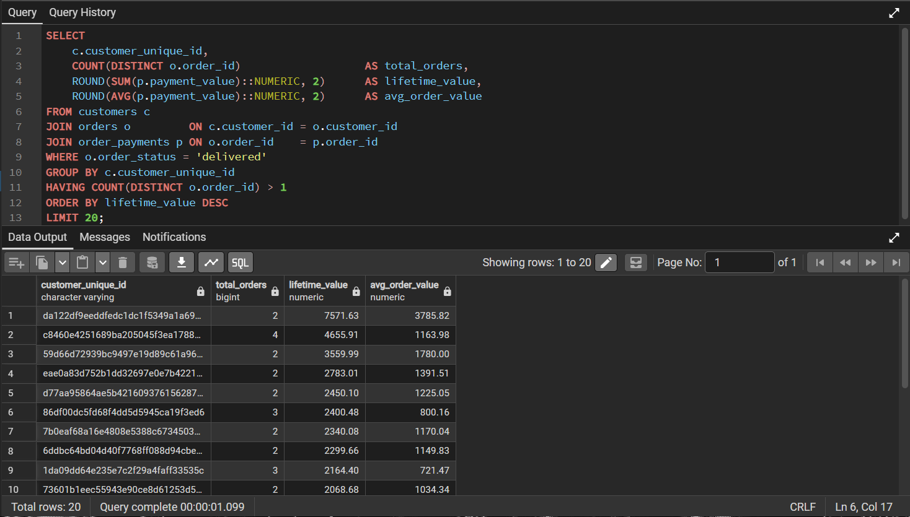
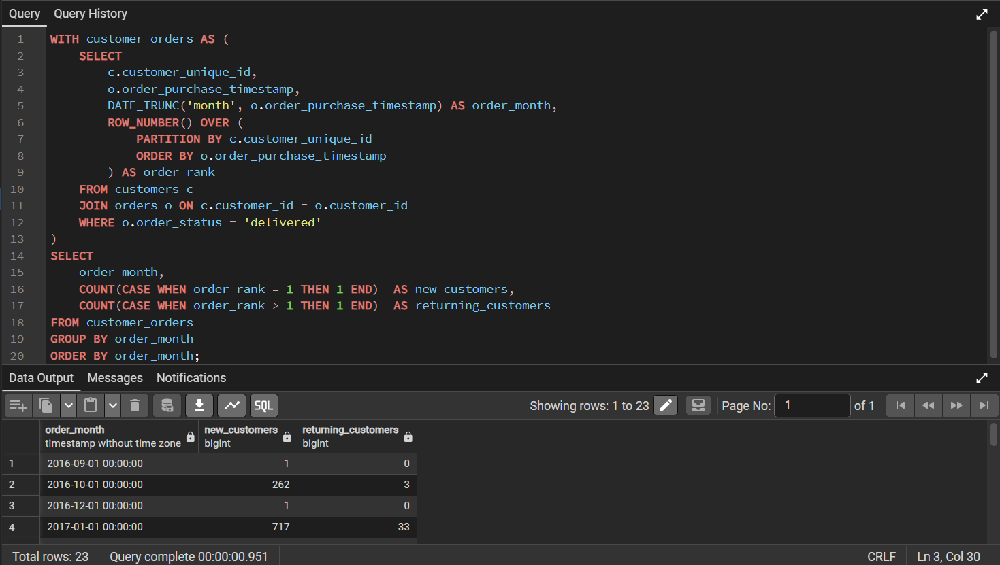
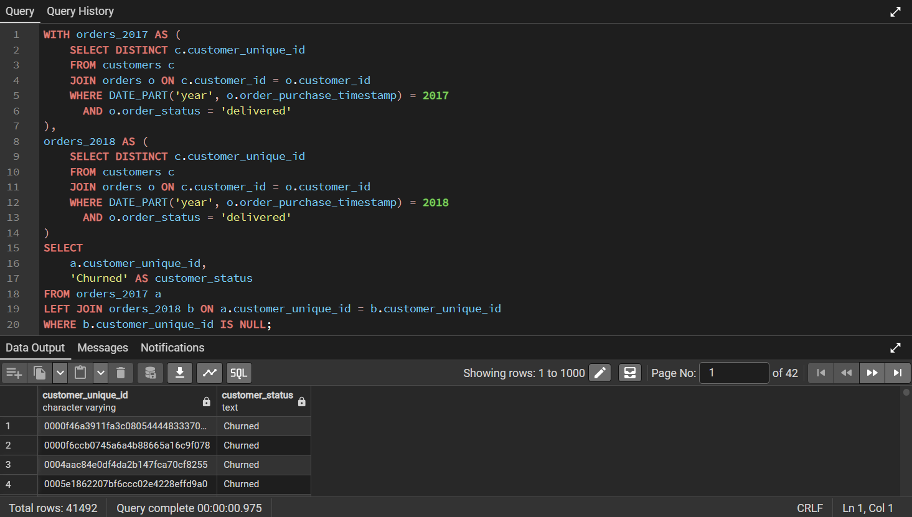
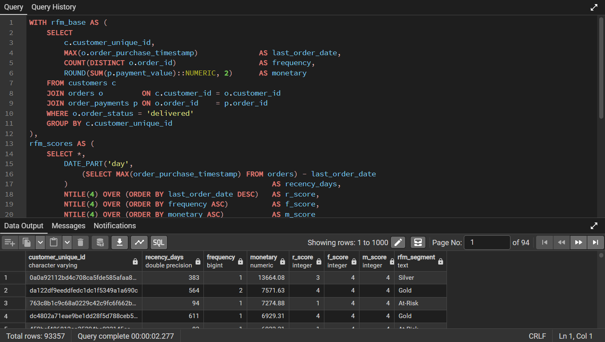
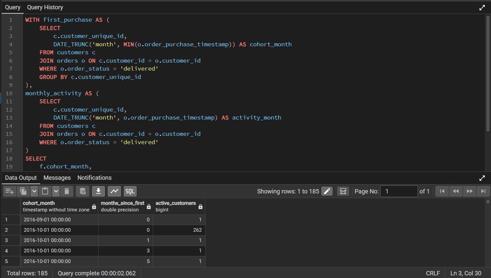

# 🛒 SQL Customer Intelligence — Olist E-Commerce Analysis


## 📸 Query Results

### Query 1 — Top 20 Customers by Lifetime Value


### Query 2 — New vs Returning Customers


### Query 3 — Churn Flag


> **End-to-end customer intelligence analysis on 100,000+ real e-commerce orders using advanced PostgreSQL — covering CLV, churn, RFM segmentation, and cohort retention.**

---

## 👤 Author

**Sumit Yadav**
[](https://github.com/sumit-yadav08)
[](https://www.linkedin.com/in/sumit-yadav-436702398)

### Query 4 — RFM Segmentation


### Query 5 — Cohort Retention

---

## 📌 Project Overview

This project answers **5 real business questions** that a data analyst would face at an e-commerce company — using the Brazilian Olist dataset from Kaggle.

The goal was not just to write SQL queries, but to think like a business analyst:
- **Who** are the most valuable customers?
- **Are** we growing or just churning?
- **Which** customers are about to leave?
- **How** do we segment customers for targeted marketing?
- **How sticky** is our product month over month?

---

## 🗄️ Dataset

| Detail | Info |
|--------|------|
| Source | [Olist Brazilian E-Commerce — Kaggle](https://www.kaggle.com/datasets/olistbr/brazilian-ecommerce) |
| Size | 100,000+ orders across 9 tables |
| Period | 2016 – 2018 |
| Tables | customers, orders, order_items, order_payments, order_reviews, products, sellers, geolocation, category_translation |

### Schema Overview

```
customers ──< orders ──< order_items ──> products
                  └────< order_payments
                  └────< order_reviews
                                └──> sellers
```

---

## 📊 Business Questions & Queries

| # | File | Business Question | Techniques Used |
|---|------|-------------------|-----------------|
| 1 | `02_top_customers_clv.sql` | Who are the top 20 highest-value customers? | JOIN, GROUP BY, HAVING, ROUND |
| 2 | `03_new_vs_returning.sql` | Are we acquiring new or retaining existing customers? | CTE, ROW_NUMBER, PARTITION BY |
| 3 | `04_churn_flag.sql` | Which customers bought in 2017 but never returned in 2018? | CTE, LEFT JOIN, DATE_PART |
| 4 | `05_rfm_segmentation.sql` | How do we segment all customers by value tier? | CTE, NTILE, CASE WHEN, Window Functions |
| 5 | `06_cohort_retention.sql` | How long do customers stay active after first purchase? | CTE, DATE_TRUNC, AGE, Multi-join |

---

## 💡 Key Business Insights

### Query 1 — Top Customers by Lifetime Value
- Top 20 customers contribute disproportionately high revenue
- High CLV customers have significantly higher average order values
- Insight: A VIP loyalty tier could retain these customers at low cost

### Query 2 — New vs Returning Customers
- Over **90% of monthly orders come from new customers**
- Returning customer rate is critically low
- Insight: The business is heavily acquisition-dependent — a retention strategy is urgently needed

### Query 3 — Customer Churn
- **40,000+ customers** who purchased in 2017 never returned in 2018
- This represents a massive win-back campaign opportunity
- Insight: Even a 5% win-back rate at avg. order value = significant revenue recovery

### Query 4 — RFM Segmentation
- Majority of customers fall in **Bronze or At-Risk** segments
- Gold segment (high R + F + M) is very small — under 3% of total customers
- Insight: Most customers buy once and never return — onboarding and retention flows are missing

### Query 5 — Cohort Retention
- Month 1 retention drops to **under 5%** across all cohorts
- No cohort shows strong retention beyond Month 2
- Insight: Product-market fit exists (people buy) but loyalty mechanisms are missing entirely

---

## 🧠 SQL Concepts Demonstrated

| Concept | Used In |
|---------|---------|
| CTEs (`WITH` clause) | Queries 2, 3, 4, 5 |
| Window Functions (`OVER`, `PARTITION BY`) | Queries 2, 4 |
| `ROW_NUMBER()` | Query 2 |
| `NTILE(4)` for scoring | Query 4 |
| `DATE_TRUNC`, `DATE_PART`, `AGE` | Queries 3, 5 |
| Multi-table `JOIN` | All queries |
| `LEFT JOIN` for churn detection | Query 3 |
| `CASE WHEN` for segmentation | Query 4 |
| `HAVING` clause | Query 1 |
| Aggregate Functions (`SUM`, `COUNT`, `AVG`, `MAX`) | All queries |
| Subqueries | Query 4 |

---

## 📁 Project Structure

```
sql-customer-intelligence/
│
├── 📁 queries/
│   ├── 01_create_tables.sql          ← Schema setup for all 9 tables
│   ├── 02_top_customers_clv.sql      ← Top 20 customers by lifetime value
│   ├── 03_new_vs_returning.sql       ← New vs returning customer split
│   ├── 04_churn_flag.sql             ← Churned customer identification
│   ├── 05_rfm_segmentation.sql       ← RFM scoring and segment labels
│   └── 06_cohort_retention.sql       ← Cohort-based retention analysis
│
├── 📁 results/
│   ├── 02_top_customers_clv.csv
│   ├── 03_new_vs_returning.csv
│   ├── 04_churn_flag.csv
│   ├── 05_rfm_segmentation.csv
│   └── 06_cohort_retention.csv
│
├── 📁 screenshots/
│   ├── query2_top_customers.png
│   ├── query3_new_vs_returning.png
│   ├── query4_churn_flag.png
│   ├── query5_rfm_segmentation.png
│   └── query6_cohort_retention.png
│
└── 📄 README.md
```

---

## 🚀 How to Reproduce This Project

### Prerequisites
- PostgreSQL 15+
- pgAdmin 4
- Kaggle account (free) to download the dataset

### Step 1 — Download the Dataset
```
https://www.kaggle.com/datasets/olistbr/brazilian-ecommerce
```
Download and unzip — you will get 9 CSV files.

### Step 2 — Set Up the Database
```sql
CREATE DATABASE olist_analytics;
```

### Step 3 — Create Tables
Run `queries/01_create_tables.sql` in pgAdmin Query Tool to create all 9 tables.

### Step 4 — Import CSVs
For each table in pgAdmin:
```
Right click table → Import/Export Data
→ Import | Format: CSV | Header: ON | Delimiter: ,
→ Select matching CSV file → OK
```

### Step 5 — Run the Queries
Open any `.sql` file from the `queries/` folder and run in pgAdmin.
Results are saved in the `results/` folder as CSV exports.

---

## 🛠️ Tools Used

| Tool | Purpose |
|------|---------|
| PostgreSQL 15 | Database engine |
| pgAdmin 4 | Query interface & data import |
| Kaggle | Dataset source |
| Git & GitHub | Version control & portfolio hosting |

---

## 📬 Connect With Me

If you found this project helpful or want to collaborate:

- 🔗 **LinkedIn:** [Sumit Yadav](https://www.linkedin.com/in/sumit-yadav-436702398)
- 💻 **GitHub:** [sumit-yadav08](https://github.com/sumit-yadav08)

---

*Built as part of a SQL portfolio series covering retail & e-commerce business analytics.*
